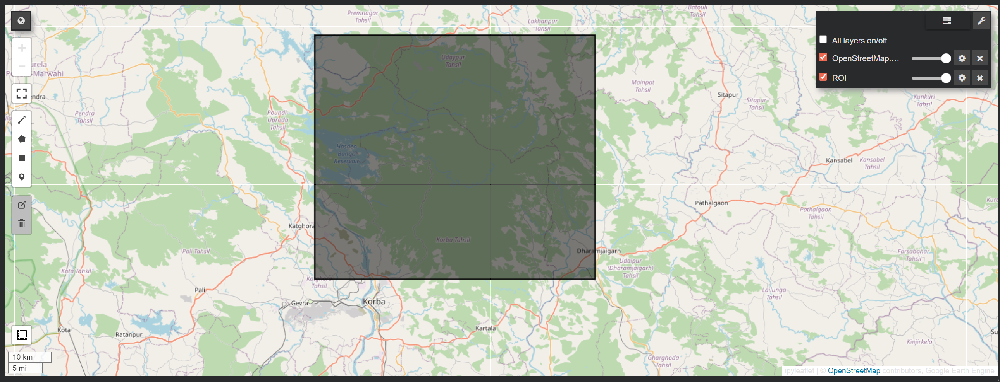
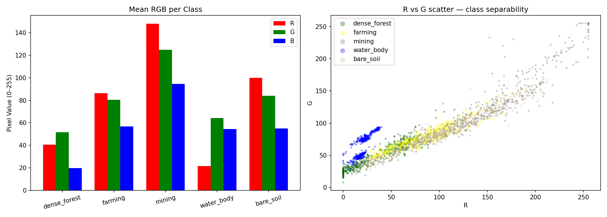

<div align="center">


<br/><br/>

# 🌿 Urban Leaf Health Monitoring

**An end-to-end remote sensing & machine learning system for tracking urban vegetation health, land-use change, and ecological disturbances using multi-spectral satellite imagery.**

<br/>

[](LICENSE)
[](https://python.org)
[](https://nextjs.org)
[](https://pytorch.org)
[](https://typescriptlang.org)
[](https://earthengine.google.com)

<br/>

[🚀 Quick Start](#-quick-start) · [🌍 Study Regions](#-study-regions) · [🏗️ Architecture](#%EF%B8%8F-architecture--pipeline) · [📊 Results](#-evaluation-metrics) · [🤝 Contributing](#-contributing)

</div>

---

## 📖 Table of Contents

- [About The Project](#-about-the-project)
- [Key Features](#-key-features)
- [Sandbox Previews](#-sandbox-previews)
- [Tech Stack](#-tech-stack)
- [Architecture & Pipeline](#%EF%B8%8F-architecture--pipeline)
- [Study Regions](#-study-regions)
- [Project Structure](#-project-structure)
- [Quick Start](#-quick-start)
- [Web Application](#-web-application)
- [HPC Training Workflow](#-hpc-training-workflow)
- [Evaluation Metrics](#-evaluation-metrics)
- [Roadmap](#-roadmap)
- [Contributing](#-contributing)
- [License](#-license)

---

## 🌟 About The Project

**Urban Leaf Health Monitoring** is a comprehensive, production-grade pipeline that leverages **multi-spectral Sentinel-2 satellite imagery**, **deep learning**, and an **interactive Next.js web application** to deliver actionable ecological intelligence for urban planning, conservation, and environmental monitoring.

The system solves a fundamental challenge in geospatial science:

> *How do we transform raw satellite data into a full machine-learning pipeline for pixel-level vegetation and disturbance segmentation at scale?*

By integrating cloud-masked data ingestion from **Google Earth Engine**, a **14-channel Attention U-Net** model, and a browser-based segmentation comparison tool, this project delivers a complete research-to-web workflow for monitoring forests, bushfire recovery, and urban encroachment across diverse geographic regions.

---

## ✨ Key Features

| Feature | Description |
|---|---|
| 🛰️ **Multi-Spectral Ingestion** | Pulls 10 Sentinel-2 bands + 4 computed indices (NDVI, EVI, SAVI, BSI) via Google Earth Engine |
| ☁️ **Cloud-Masked Pipeline** | Strict `QA60` cloud filtering ensures high-quality, cloud-free imagery |
| 🔬 **Attention U-Net** | 14-channel input, 5-class dense prediction with attention gates for selective focus |
| 🧪 **Domain-Aware Augmentation** | Spectral jitter, random band dropout, spatial transforms — purpose-built for satellite imagery |
| ⏱️ **Temporal Analysis** | Multi-year and event-window comparisons (pre/during/post disturbance) |
| 🌐 **Interactive Web App** | Side-by-side model comparison lab built with Next.js, WebWorkers, and canvas rendering |
| 🖥️ **HPC-Ready** | Full PBS job scripts, environment setup, AMP training, and H100-optimized training loop |
| 📦 **Dashboard-Ready Artifacts** | Inference exports segmentation masks, overlays, JSON summaries, and GeoTIFFs |

---

## 🖼️ Sandbox Previews

### 🛰️ Region of Interest — Coordinate Selection



> Defining geographic bounding boxes for the Hasdeo study area inside Google Earth Engine.

---

### ☁️ Cloud Masking — Before & After


> Applying `QA60` cloud and cirrus masking ensures downstream vegetation analysis is not polluted by cloud shadows.

---

### 📉 Vegetation Degradation — NDVI Analysis


> NDVI-based degradation visualization exposing deforestation signals in the Hasdeo Forest between 2018–2023.

---

### 📈 Year-Wise Comparison Results

<div align="center">
  
  &nbsp;
  
</div>

> *(Top)* Cumulative forest loss chart across the Hasdeo timeline. *(Bottom)* Class separability matrix validating spectral feature quality.

---

## 🛠️ Tech Stack

### 🌐 Web Application

| Technology | Purpose |
|---|---|
|  **Next.js 14** | App Router, API routes, file serving |
|  **React 18** | Component model, hooks, transitions |
|  **TypeScript 5.5** | Full type safety across the web layer |
| 🕸️ **Web Workers** | Background thread pixel classification — UI stays responsive |
| 🎨 **Canvas API** | Client-side mask rendering and overlay compositing |
|  **Lucide React** | Icon system |

### 🐍 ML & Geospatial Pipeline

| Technology | Purpose |
|---|---|
|  **PyTorch 2.2+** | Attention U-Net training, AMP, GradScaler |
|  **Earth Engine API** | Sentinel-2 data export, cloud filtering |
| 🗺️ **Rasterio + GDAL** | GeoTIFF I/O, spatial referencing |
| 🌐 **GeoPandas + Shapely** | Vector geometry, AOI manipulation |
| 🔬 **Albumentations** | Augmentation pipeline (spatial + spectral) |
| 🖼️ **OpenCV (headless)** | Image transforms, mask processing |
| 📐 **NumPy + Pandas** | Patch arrays, statistics, CSV processing |
| 🤖 **Scikit-Learn** | Baseline models (SVM, Random Forest) |
| 🗺️ **geemap** | Earth Engine visualization |
| 📊 **Matplotlib** | Plot generation and reporting |

---

## 🏗️ Architecture & Pipeline

The backend follows a clean **6-phase pipeline**, each encapsulated in its own module:

```
┌─────────────────────────────────────────────────────────────────────┐
│                     Urban Leaf ML Pipeline                          │
├───────────┬─────────────────┬─────────────────────────────────────  │
│  Phase 1  │ Data Collection │ GEE → 10 bands + 4 indices → GeoTIFF │
│  Phase 2  │ Preprocessing   │ Patch extraction (256×256, stride 128)│
│  Phase 3  │ Augmentation    │ Spatial + Spectral (SpectralJitter,   │
│           │                 │ RandomBandDrop, flips, noise)         │
│  Phase 4  │ Model           │ Attention U-Net (14ch in, 5-class out)│
│  Phase 5  │ Training        │ AMP, Cosine LR, Combined Dice+CE Loss │
│  Phase 6  │ Inference       │ Tiled prediction → mask/overlay/JSON  │
└───────────┴─────────────────┴───────────────────────────────────────┘
```

### 🧠 Model — Attention U-Net

```
Input: (B, 14, 256, 256)  ← 10 Sentinel-2 bands + NDVI, EVI, SAVI, BSI

Encoder:  DoubleConv → Down → Down → Down → Down (bottleneck)
Decoder:  Up + AttentionGate × 4
Output:   (B, 5, 256, 256)  ← 5 land-cover classes
```

**5 Output Classes:**
1. 🌳 Vegetation
2. 🌾 Sparse Vegetation  
3. 🟫 Bare Soil / Rock
4. 🏙️ Built-up / Urban
5. 💧 Water / Shadow

**Loss:** `50% CrossEntropy + 50% Dice Loss` — balances pixel accuracy with region-overlap quality.

---

## 🌍 Study Regions

| Region | Focus | Time Range |
|---|---|---|
| 🌲 **Hasdeo Forest, India** | Mining-driven deforestation, NDVI degradation signals | 2018 – 2024 |
| 🏙️ **Sydney Blue Mountains Fringe, AU** | Urban expansion, ecological boundary shifts | Multi-year |
| 🔥 **Kangaroo Island, AU** | Black Summer bushfire impact & post-fire recovery | 2020 – 2021 |

---

## 📁 Project Structure

```text
Urban-Leaf-Health-Monitoring/
│
├── 📁 app/                             # Next.js 14 Web Application
│   ├── segmentation-lab/               # Side-by-side segmentation comparison UI
│   │   ├── page.tsx                    # Main page with upload, sample selector, KPIs
│   │   └── segmentation.worker.ts      # Web Worker — runs pixel classification off main thread
│   ├── hypothesis/                     # Hypothesis/analysis pages
│   ├── recommendation/                 # Recommendation pages
│   ├── api/                            # Next.js API routes (asset serving)
│   ├── globals.css                     # Global CSS design system
│   └── layout.tsx                      # Root layout
│
├── 📁 h100_config/                     # Core ML Pipeline (HPC-ready)
│   ├── 01_data_collection.py           # GEE Sentinel-2 data collection
│   ├── 02_preprocessing.py             # Patch extraction, normalization
│   ├── 03_augmentation.py              # Spatial + spectral augmentation
│   ├── 04_model.py                     # Attention U-Net architecture + losses
│   ├── 05_train.py                     # Training loop (AMP, checkpointing)
│   ├── 06_predict_visualize.py         # Inference, mask/overlay export
│   ├── setup_env.sh                    # HPC environment setup
│   ├── job_cpu.pbs                     # PBS CPU job script
│   ├── job_gpu.pbs                     # PBS GPU job script
│   └── LOCAL_TEST.py                   # Local pipeline test runner
│
├── 📁 scripts/                         # Research Notebooks & Analysis
│   ├── 01_area_of_interest_selection/  # ROI selection notebooks
│   ├── 02_comparison_based_on_events/  # Event-window comparison (bushfire, mining)
│   ├── 03_comparison_based_on_years/   # Multi-year temporal analysis
│   ├── 04_data_agumentation/           # Augmentation experiments
│   └── 05_data_modelling/              # Model training notebooks
│
├── 📁 data/                            # Earth Engine exports & datasets
│   ├── 01_area_of_interest_selection_using_sampling/
│   │   ├── batch_1/                    # Hasdeo Forest dataset
│   │   ├── batch_2/                    # Sydney Blue Mountains dataset
│   │   └── batch_3/                    # Kangaroo Island dataset
│   └── 02_comparison_based_on_events/
│       ├── event_1/                    # Hasdeo event CSVs and TIFF exports
│       └── event_2/                    # Additional event data
│
├── 📁 assets/                          # Visualizations & project media
│   ├── plots/                          # Result plots (plot_1.png … plot_10.png)
│   ├── year_wise_comparison/           # Year-over-year forest change charts
│   ├── presentation_images/            # Key images (NDVI, cloud removal, ROI)
│   └── ppts/                           # Presentation PDFs
│
├── 📁 docs/                            # Technical documentation
│   ├── Urban_Leaf_Model_Pipeline_Guide.md
│   └── Urban_Leaf_Web_Project_Guide.md
│
├── package.json                        # Node.js dependencies
├── requirements.txt                    # Python dependencies
├── next.config.mjs                     # Next.js configuration
├── tsconfig.json                       # TypeScript configuration
└── README.md
```

---

## 🚀 Quick Start

### Prerequisites

- **Node.js** `18+` — for the web application
- **Python** `3.9+` — for the ML pipeline
- **pip / conda** — for Python dependency management
- **Google Earth Engine account** — for data collection

---

### 1️⃣ Clone the Repository

```bash
git clone https://github.com/vijaysolanki9079/Urban-Leaf-Health-Monitoring.git
cd Urban-Leaf-Health-Monitoring
```

---

### 2️⃣ ML Pipeline Setup

```bash
# Install Python dependencies
pip install -r requirements.txt

# Authenticate with Google Earth Engine
earthengine authenticate
```

---

### 3️⃣ Web Application Setup

```bash
# Install Node.js dependencies
npm install

# Run the development server
npm run dev
```

> Open [http://localhost:3000](http://localhost:3000) to view the **Segmentation Lab** and interactive comparison tools.

---

## 🌐 Web Application

The web application provides an **interactive Segmentation Comparison Lab** that:

- 📤 Accepts user-uploaded PNG / JPEG / WebP images (up to 30 MB)
- 🔄 Runs **two segmentation engines simultaneously** in a dedicated Web Worker (keeps the UI fully responsive)
- 🎨 Renders **colour-coded segmentation masks and overlays** using the Canvas API
- 📊 Displays **class distribution bars** and **4 derived scene indicators** — Canopy Cover, Built-up Share, Exposed Surface, Water/Shadow
- 🖼️ Includes **3 preloaded sample scenes** from the Hasdeo and Kangaroo Island datasets

```bash
npm run dev        # Development server (hot reload)
npm run build      # Production build
npm run lint       # ESLint check
npm run typecheck  # TypeScript type check
```

---

## 🖥️ HPC Training Workflow

For running the model training pipeline on an HPC cluster (PBS/Slurm):

```bash
cd h100_config

# 1. Set up the environment
bash setup_env.sh

# 2. Submit CPU preprocessing job
qsub job_cpu.pbs

# 3. Submit GPU training job
qsub job_gpu.pbs
```

**Manual training and inference:**

```bash
# Train the Attention U-Net
python h100_config/05_train.py \
  --data-dir /path/to/augmented \
  --model-dir /path/to/models \
  --results-dir /path/to/results

# Run inference & export visualizations
python h100_config/06_predict_visualize.py \
  --checkpoint /path/to/models/best_model.pth \
  --input /path/to/processed \
  --output-dir /path/to/results/inference
```

**Training outputs:**
- `best_model.pth` — best checkpoint by validation mIoU
- `training_history.json` / `.csv` — full loss/metric history
- `pseudo_label_distribution.json` — class imbalance report
- `*.png` overlays, `*.tif` masks, `*.json` summaries from inference

**H100 optimizations enabled:**
- ✅ TF32 matmul & cuDNN
- ✅ cuDNN benchmark mode
- ✅ AMP with GradScaler
- ✅ Gradient accumulation & clipping
- ✅ Cosine annealing LR schedule

---

## 📊 Evaluation Metrics

| Metric | Type | Purpose |
|---|---|---|
| **mIoU** | Segmentation | Mean Intersection over Union — primary quality metric |
| **Dice Coefficient** | Segmentation | Region-overlap quality across all classes |
| **Pixel Accuracy** | Classification | Fraction of correctly classified pixels |
| **Precision / Recall** | Classification | Per-class accuracy analysis |
| **Confusion Matrix** | Classification | Full inter-class error breakdown |
| **Land-cover loss %** | Temporal | Quantitative deforestation / recovery tracking |

---

## 🗺️ Roadmap

### ✅ Phase 1: Data Engineering
- [x] GEE-based Sentinel-2 data collection
- [x] Cloud masking & valid-pixel filtering
- [x] Patch extraction & radiometric normalization
- [x] Spectral augmentation pipeline
- [ ] Full local sync of 1,000+ Hasdeo GeoTIFF files

### ✅ Phase 2: Core Analytics
- [x] Spectral indices: NDVI, EVI, SAVI, BSI, NBR
- [x] Attention U-Net implementation
- [x] AMP training with checkpointing and resume
- [ ] Expert ground-truth masks & final benchmark metrics

### ✅ Phase 3: Temporal & Event Analysis
- [x] Hasdeo mining event comparison (2022 window)
- [x] Monthly/seasonal time-series exports
- [x] Inference masks, overlays, GeoTIFFs & JSON summaries
- [ ] Live checkpoint integration into web segmentation page

---

## 🤝 Contributing

Contributions are very welcome! Whether it's selecting new study regions, improving the augmentation pipeline, or enhancing the web UI — feel free to get involved.

1. Fork the repository
2. Create your feature branch: `git checkout -b feature/your-feature`
3. Commit your changes: `git commit -m 'feat: add your feature'`
4. Push to the branch: `git push origin feature/your-feature`
5. Open a Pull Request

---

## 📄 License

This project is licensed under the **MIT License** — see the [LICENSE](LICENSE) file for details.

```
MIT License

Copyright (c) 2026 Vijay Solanki

Permission is hereby granted, free of charge, to any person obtaining a copy
of this software and associated documentation files (the "Software"), to deal
in the Software without restriction, including without limitation the rights
to use, copy, modify, merge, publish, distribute, sublicense, and/or sell
copies of the Software, and to permit persons to whom the Software is
furnished to do so, subject to the following conditions:

The above copyright notice and this permission notice shall be included in all
copies or substantial portions of the Software.
```

---

<div align="center">

Made with 🌿 by **Vijay Solanki**

⭐ Star this repository if you found it useful!

</div>
